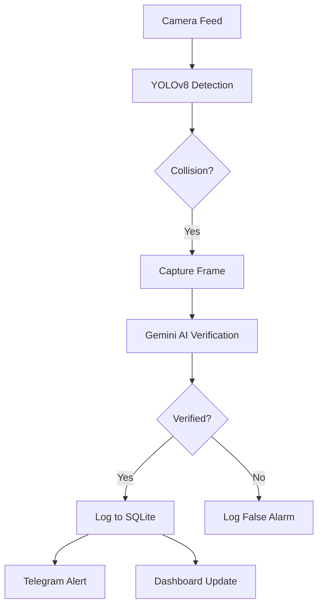

# 🛡️ Vision Shield X [v2.0]

**Vision Shield X** is a high-fidelity, AI-driven road safety platform that monitors traffic feeds in real-time, detects collisions using advanced computer vision, and orchestrates emergency responses through intelligent verification.


## ✨ Key Features (v2.0 Upgrade)

### 🚀 Advanced Detection Engine
*   **Dual-Layer Intelligence**: Combines **YOLOv8** (Local Edge Detection) with **Gemini 1.5 Flash** (Cloud Cognitive Verification).
*   **Geometric Collision Logic**: Uses IoU (Intersection over Union) to detect vehicle proximities and potential impact zones.
*   **Zero-False-Alarm Protocol**: Gemini AI filters out non-accident overlaps (parking, close drives) by analyzing visual context.

### 🖥️ Mission Control Interface (Antigravity Dashboard)
*   **Futuristic Glassmorphic Design**: A premium, dark-themed dashboard built with PyQt5.
*   **Live Metrics**: Real-time monitoring of Camera Health, AI Confidence, and Alert Statistics.
*   **Unified Emergency Log**: A consolidated, real-time feed of system updates and critical alerts.

### 📊 Persistence & Connectivity
*   **SQLite Integration**: All incidents are logged to a persistent database for historical audit and analytics.
*   **Instant Telegram Alerts**: Automated dispatch of verified incident images and AI-generated descriptions to emergency channels.
*   **Config Isolation**: Clean separation of API secrets and camera configurations.

## 🛠️ Tech Stack
*   **Logic**: Python 3.x
*   **Vision**: YOLOv8 (Ultralytics), OpenCV
*   **Brain**: Google Gemini 1.5 Flash
*   **UI**: PyQt5 (Modern CSS3)
*   **Storage**: SQLite3

## 🚦 Quick Start

1. **Clone the repository**:
   ```bash
   git clone https://github.com/Divyakumar023/Vision-Shield-X-AI-Powered-Real-Time-Accident-Detection.git
   ```

2. **Install Dependencies**:
   ```bash
   pip install -r requirements.txt
   ```

3. **Configure API Keys**:
   Edit `accident_detection_system.py` or provide a `.env` file for:
   * `GEMINI_API_KEY`
   * `TELEGRAM_BOT_TOKEN`
   * `TELEGRAM_CHAT_ID`

4. **Launch the Node**:
   ```bash
   python accident_detection_system.py
   ```

## 📐 Architecture



---
**Vision Shield X** - *Securing Roads with Intelligence.*
